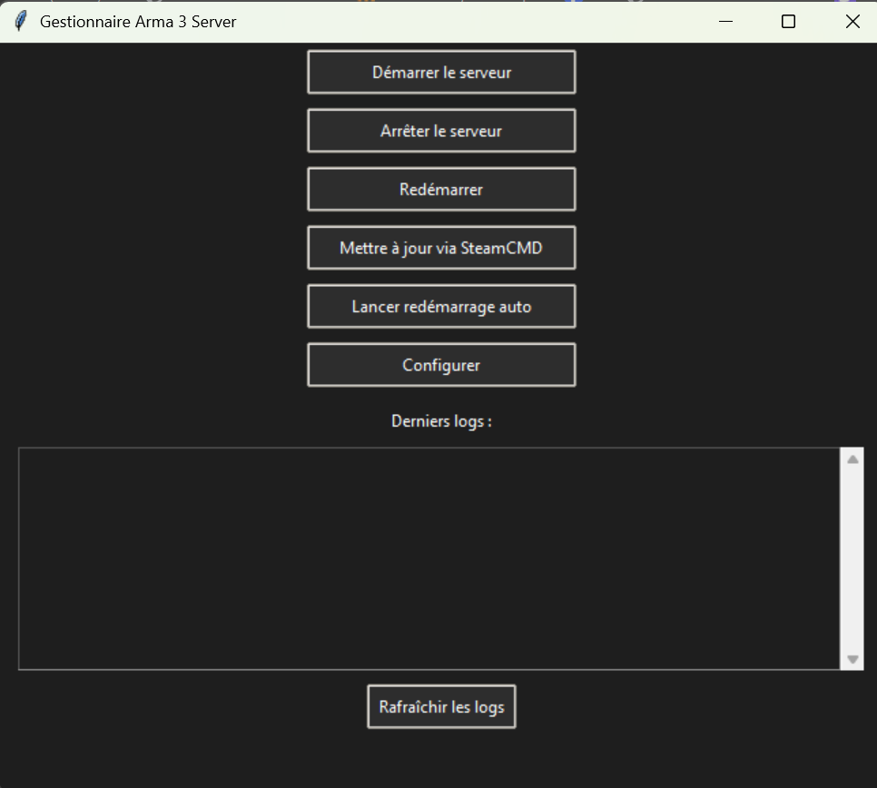
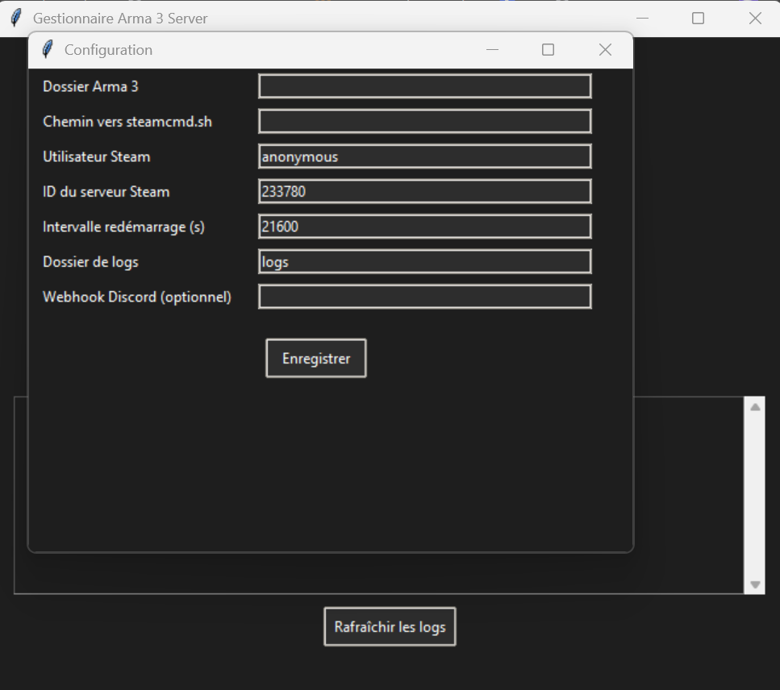

# Gestionnaire de Serveur Arma 3 - Interface Graphique Python

Ce projet est une **application Python avec interface graphique** permettant de gérer facilement un serveur **Arma 3** sous Linux ou Windows.

> But : Démarrer, arrêter, redémarrer, mettre à jour et monitorer un serveur Arma 3 **sans ligne de commande**, avec une interface sombre conviviale.

---

## Fonctionnalités

- Démarrage / Arrêt du serveur
- Redémarrage automatique toutes les X heures
- Mise à jour automatique via **SteamCMD**
- Lecture facile des logs
- Configuration sauvegardée localement (`config.json`)
- Interface **Dark mode**
- Compatible Windows & Linux

---

## Capture d’écran

## 🖥️ Aperçu de l'interface





---
---

## Téléchargement (Windows)

> Pas envie d’installer Python ou lancer le script manuellement ?

Télécharge directement l’application Windows prête à l’emploi :

### [ Télécharger Arma3ServManager.exe](./Arma3ServManager.exe)

- Aucun besoin d’installation
- Double-cliquez simplement pour lancer l’application
- Compatible Windows 10 / 11

Si Windows vous affiche un avertissement de sécurité, cliquez sur **“Informations complémentaires” → “Exécuter quand même”** (car le fichier n’est pas signé numériquement, mais il est sûr).

---


## Prérequis

- Python 3.7 ou supérieur
- `psutil` :
  ```bash
  pip install psutil
